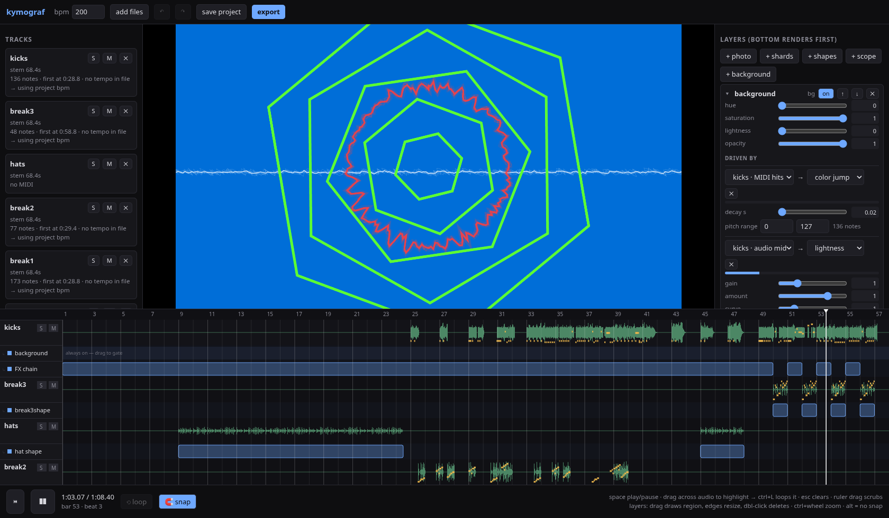
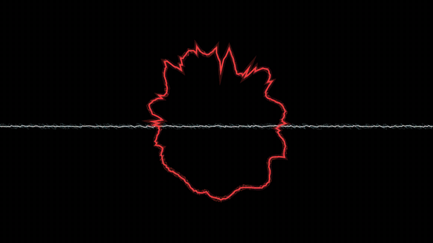
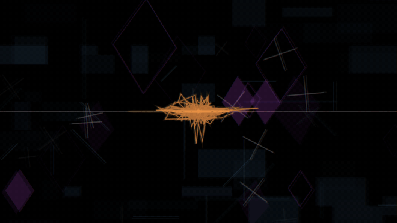
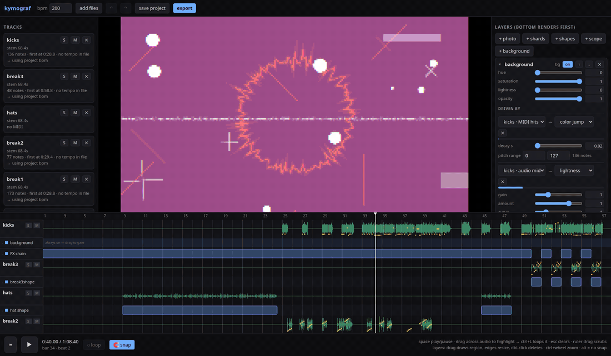
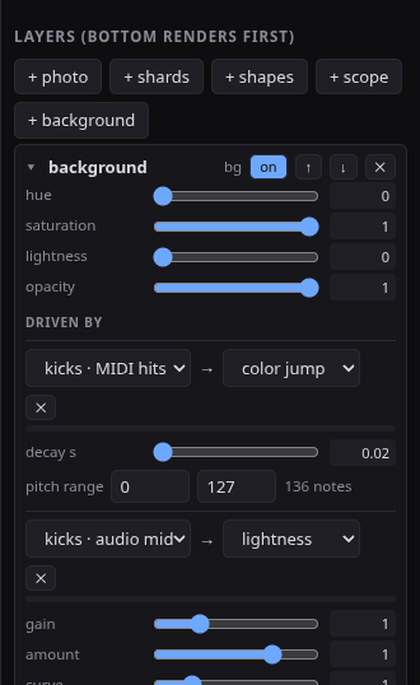

# kymograf

**Make music videos the way you make music.**

kymograf is a MIDI + audio-reactive video renderer with a DAW-style workflow:
drop in your song's stems and MIDI, map them to visual layers, arrange on a
timeline, and export a deterministic 1920×1080@60fps video. Built by a
producer for fast, glitchy, geometric music videos — but it doesn't
care what genre you feed it.



<p align="center">
  
  
</p>
<p align="center"><em>drum-triggered cuts at 200 bpm · lissajous scope (bass × hats) at half speed over a kick-synced glitch field</em></p>

## Why it's different

Most tools give you *audio-reactive* visuals (everything wobbles to loudness)
or make you hand-keyframe cuts. kymograf treats your **session itself** as the
control signal:

- **MIDI note events** are discrete triggers — every kick can cut to a new
  image, every snare can slam the hue, with per-pitch filtering so one drum
  MIDI file drives many different things.
- **Per-stem audio envelopes** (RMS + low/mid/high bands) are continuous
  modulators — a bass holding one note stays visually alive.
- **Everything is a pure function of song time.** No wall-clock, no unseeded
  randomness — the export matches the preview frame-for-frame, every render.




<p align="center"><em>waterfall scope on the bass stem</em></p>

## Features

- **Timeline** — waveforms + MIDI lanes per track, BPM grid, loop regions
  (drag across audio, `Ctrl+L`), solo/mute, snap with `Alt` bypass
- **Layers** — photos (cut on hits), photo shards, 16 geometric shape modes,
  5 oscilloscope modes (line / mirrored / circle / lissajous XY / waterfall),
  color backgrounds — all with mappable hue/rotation/params
- **Gates** — draw regions on a layer's lane to control *when* it exists;
  the FX chain gates the same way
- **17 FX** — zoom punch, shake, RGB split, slice glitch, pixelate, zoom blur,
  feedback trails, time stutter, hue rotate, CRT, grain, twist, bulge, …
- **Audio onset detection** — stems without MIDI can still fire triggers
- **Undo/redo, autosave, project files** that re-render identically forever
- **Hard photosensitivity guard** — full-frame flashes capped at 3/sec,
  not optional



## Install

Grab the latest build from **[Releases](../../releases)**:

- **Linux** — AppImage: `chmod +x` and run
- **Windows** — installer `.exe`
- **macOS** — `.dmg` (arm64 for Apple Silicon, x64 for Intel). Builds are
  unsigned: the first launch needs **right-click → Open** (or
  `xattr -cr /Applications/kymograf.app`)

Or run the web version from source — everything works in Chrome/Chromium
except native file re-linking and file watching:

```sh
npm install
npm run dev     # web app (Chromium recommended; export requires WebCodecs)
npm run app     # desktop app (needs the dev server, or `npm run build` first)
```

## Demo

Click **▶ load demo project** on the start screen — it's not a toy scene,
it's the *actual project* behind the first music video ever made with
kymograf: **"imgonnablowup" by c0rd** (instrumental stems, 200 BPM, 7 tracks,
10 layers, 26 mappings). Poke at the gates, scrub the timeline, break it,
re-map it — that's the tutorial.

## Quickstart

1. **Drop files anywhere**: stems (`.wav`/`.mp3`/`.flac`), MIDI (`.mid`),
   photos. Same base name (`drums.wav` + `drums.mid`) pairs into one track.
   BPM auto-reads from the MIDI.
2. **Add a layer** (right panel) and open its card.
3. **Add a signal**: e.g. `drums · MIDI hits → photo cut`, or
   `bass · audio low → FX feedback`. Watch the live meter move.
4. **Press space.** Tune while it plays — everything updates live.
5. **Gate layers** on the timeline: drag across a layer's lane to draw the
   region where it's active.
6. **Export** — offline render, sample-accurate, with audio muxed in
   (AAC via ffmpeg in the desktop app; Opus-in-MP4 fallback in the browser).

Tips: at fast tempos map with short decays (~0.1s); use `note density →
time stutter` for fills. Every "random" choice is seeded and deterministic,
so re-renders never change the moments you liked.

## ⚠ Photosensitivity

kymograf is built to produce rapidly flashing imagery. A hard cap of 3
full-frame flashes per rolling second is built in and cannot be disabled,
but exported videos can still be intense — consider a warning card on
anything you publish.

## Architecture (for the curious)

- `src/signals/` — every visual input is a `Signal { sample(t) }`, pure in
  song-time; this is what makes preview === export
- `src/audio/analysis.worker.ts` — per-stem RMS/band envelopes at 120 Hz,
  computed once at load
- `src/mapping/engine.ts` — serializable signal→parameter bindings
- `src/render/` — PixiJS layer stack + feedback/stutter/strobe-guard FX chain
- `src/export/encoder.ts` — frame-stepped offline render → WebCodecs H.264 →
  mp4-muxer
- `electron/` — thin native shell (file paths, watching, ffmpeg remux);
  the renderer is identical to the web app

Dev: `npm run fixtures` generates test assets; `node scripts/smoke.mjs`
drives the whole app headlessly (needs Chromium + dev server on :5199);
`npx electron . --smoke` self-tests the desktop shell.

## License

MIT — see [LICENSE](LICENSE). Built with [PixiJS](https://pixijs.com),
[@tonejs/midi](https://github.com/Tonejs/Midi),
[mp4-muxer](https://github.com/Vanilagy/mp4-muxer), and vibes.
